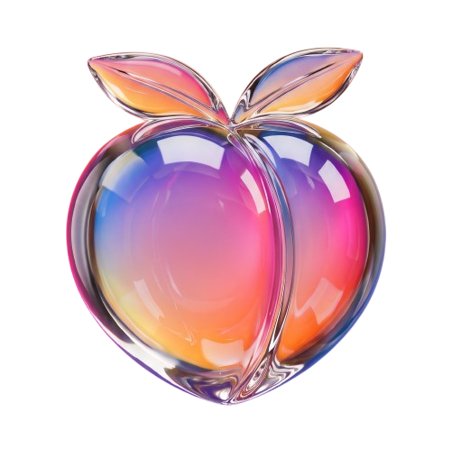

<p align="center"></p>

# LiquidAss: Liquid Glass for the Steam Frame's VR interface

LiquidAss re-skins the Steam Frame's VR UI in Apple's glass design language. AI assisted.

## Install

Run this in a terminal on the headset (Desktop Mode's terminal, or over SSH). It downloads the latest release and adds **LiquidAss** to **+ › Launch Program**:

```bash
curl -fsSL https://github.com/MichaelScottsman/LiquidAss-Frame/releases/latest/download/install.sh | sh
```

Run the same command again to update. To install a specific release, put `LIQUIDASS_VERSION=v0.1` before `sh`.

## Uninstall

This turns the theme off and removes the launcher entry, the files and your saved glass settings:

```bash
curl -fsSL https://github.com/MichaelScottsman/LiquidAss-Frame/releases/latest/download/install.sh | sh -s -- uninstall
```

## Turn it on and off (in the headset)

1. On the dashboard bar, press **+**.
2. Under **Launch Program**, pick **LiquidAss**.

A glass toast confirms "LiquidAss · On". Do the same again to turn it off.

## Nothing persists

**The theme is never written to disk.** `lgs` injects the stylesheet into the *running* Steam client through its local devtools socket (`127.0.0.1:8080`; Steam on the Frame runs with `-cef-enable-debugging`). Any of these brings back the stock UI:

- reboot the headset
- restart Steam
- launch **LiquidAss** again from **+**

Nothing starts at boot. There are no systemd units, autostart entries or Steam file patches.

Only two things stay installed, so the toggle is there after a reboot, plus one file of your own:

| Path | What it is |
|---|---|
| `~/.local/share/applications/glass-shell.desktop` | The "LiquidAss" entry in + › Launch Program |
| `~/.local/share/glass-shell/` | The toggle script and the theme files it reads |
| `~/.config/glass-shell/tune.json` | Your glass settings from the paintbrush button on the bar (colour, intensity, refraction, frost, highlights). Written only when you change them; **Reset to default** in that panel deletes it. The one exception to "nothing persists", by request |

The [uninstall](#uninstall) command (or `python glass.py uninstall`) removes all three. (The install paths keep the project's original `glass-shell` name, so existing installs carry over.)

## From the PC

```bash
python glass.py install        # copy this checkout to the headset, set up glassd and add the launcher (for development)
python glass.py on | off | toggle | status
python glass.py dial 0.7       # glass intensity: 0 = clearest, 1 = most opaque (saved with your glass settings)
python glass.py uninstall
```

On the headset itself, `~/.local/share/glass-shell/device/lgs on|off|toggle|status|dial V` does the same.

Native glass works out of the box. Releases ship glassd built for the Frame (`native/glassd/prebuilt/glassd`), and the installer puts it in place. `python glass.py install` does the same, then rebuilds glassd from the checkout's sources over it (if that build fails, the shipped binary stays). The daemon also puts the shipped binary in place whenever glassd is missing, so the LiquidAss toggle never starts CSS-only. Native mode is on by default (`device/defaults.json`).

## How it works

| Piece | Role |
|---|---|
| `device/lgs_core.js` | Runs inside Steam's SharedJSContext. Adds one `<style>` (and hidden SVG defs) to every gamepadui window through `g_PopupManager`, follows new popups, and removes everything on `off` |
| `device/lgs_index.js` | Steam's class names are hashed. The theme is written against readable names (`%{BarSurface}`, `%{*GamepadDialogContent>Field}`) that are resolved at injection time from Steam's own webpack CSS modules, so the theme survives client updates |
| `theme/*.css` | The look, split by area. `00-tokens.nowrap.css` holds the materials (window glass, panel glass, Liquid Glass, thick glass), states, radii and motion. See `docs/DESIGN.md` |
| `lab/` + `glass.py` | Development tools: navigate, open menus, screenshot any surface (it renders even when nobody wears the headset) and **audit** stock against themed for hidden, shrunk or unclickable controls and lost contrast. See `docs/LAB.md` |

## Releases

`sh tools/make_release.sh v0.2` builds `dist/LiquidAss-Frame.tar.gz` from the committed tree. Publish it with the installer:

```bash
gh release create v0.2 dist/LiquidAss-Frame.tar.gz install.sh --title "LiquidAss v0.2"
```

`install.sh` always fetches the asset named `LiquidAss-Frame.tar.gz` from the latest release, so keep that name.

## Docs

| File | What's in it |
|---|---|
| `docs/DESIGN.md` | Materials, states, components, guardrails |
| `docs/LAB.md` | Tools, token syntax, rules for working on the live UI |
| `docs/inventory/*.md` | Every surface, route and sub-menu, mapped |
| `docs/COVERAGE.md` | What was restyled and verified, screen by screen |
